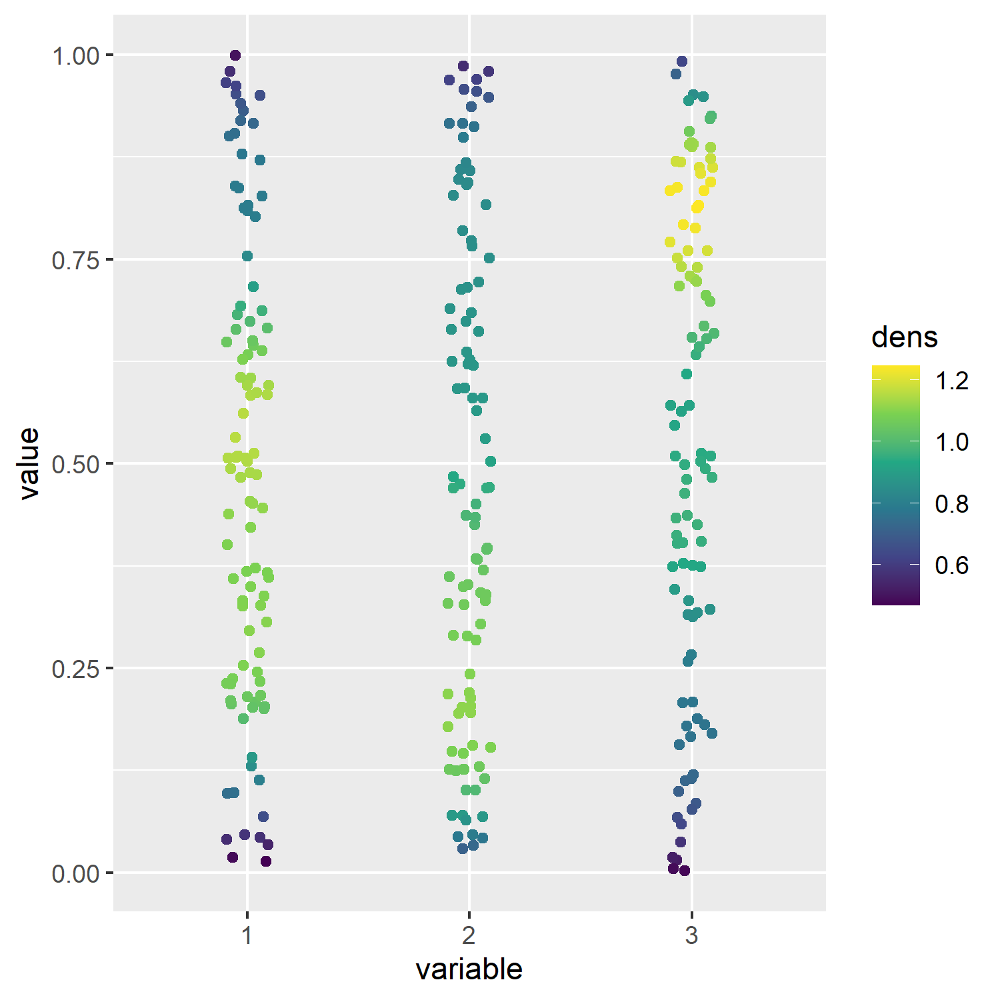

# Heatscatter 1D
Ggplot based jitterplot showing density at each x axis variable

Contains 3 functions
- `calc_density_melt()` : Melts dataframe and calculates density at each variable (for each column names)
- `calc_density()` : Calculates density on dataframe that is already divided into variables (performed melt() already)
- `heat_scatter()` : Plots jitterplot with viridis color palette as default color scale.

Dependencies:
- reshape2
- tidyverse

## Usage
```R
df <- tibble("1" = runif(100), "2" = runif(100), "3" = runif(100))

heat_scatter(calc_density_melt(df))
```


